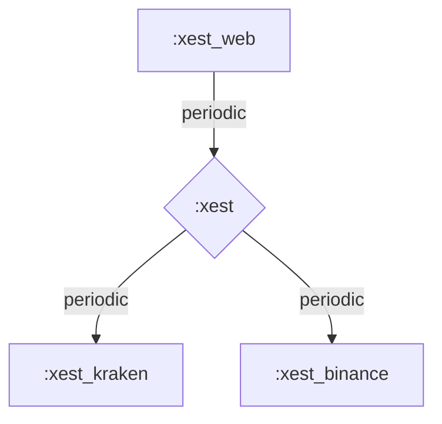

# Xest

Xest connects to various cryptocurrencies exchanges to provide an overview of your crypto assets

On each exchange, it publicly retrieves:
  - Exchange status and time
  - market tickers (WIP)

In your wallet, it privately:
  - retrieves currencies (WIP)
  - visually display your assets (WIP)

# Running

```
mix phx.server
```

# Testing

For functional async tests:
```
mix test
```

For sequential integration tests:
```
mix test --include integration
```

For a TDD setup, you can use
```
mix test.watch
```

For coverage you can use
```
mix coveralls
```

For code analysis you can use
```
mix credo
```

# Dev
This is an Elixir Umbrella project, trying to remain monorepo as long as possible.

Currently there are only two apps here:
  - Xest: the library containing domain models and various utilities for client apps
  - XestBinance: the client app connecting to binance
  - XestWeb: the Web interface with live views

For interactive testing you can use iex:

```
alexv@pop-os:/opt/Projects/elixir-playground/xest_umbrella$ iex -S mix
Erlang/OTP 23 [erts-11.1.3] [source] [64-bit] [smp:12:12] [ds:12:12:10] [async-threads:1] [hipe]

==> xest
Compiling 5 files (.ex)
Generated xest app
==> xest_web
Compiling 15 files (.ex)
Generated xest_web app

iex(1)> Xest.Binance.system_status()
%{"msg" => "normal", "status" => 0}
```

# Design

## apps
[](https://mermaid-js.github.io/mermaid-live-editor/#/edit/eyJjb2RlIjoiZ3JhcGggVERcbiAgICBCWzp4ZXN0X3dlYl0gLS0-IHxwZXJpb2RpY3wgRHs6eGVzdH1cbiAgICBcbiAgICBEIC0tPiB8cGVyaW9kaWN8IEVbOnhlc3Rfa3Jha2VuXVxuICAgIEQgLS0-IHxwZXJpb2RpY3wgRls6eGVzdF9iaW5hbmNlXVxuIiwibWVybWFpZCI6eyJ0aGVtZSI6ImRlZmF1bHQifSwidXBkYXRlRWRpdG9yIjpmYWxzZX0)



## time


# Roadmap

Exchanges:
- [ ] Binance
- [ ] Kraken
- [ ] Bitstamp
- Add your favorite...
  
- [ ] Asset visualisation
- Some way to interface with other systems, for deposit & withdrawal, accounting, trading, etc.

# Will Not Do

- Accounting
- Advanced Market Data (ie. no candles here, only ticker data)
- Trading


