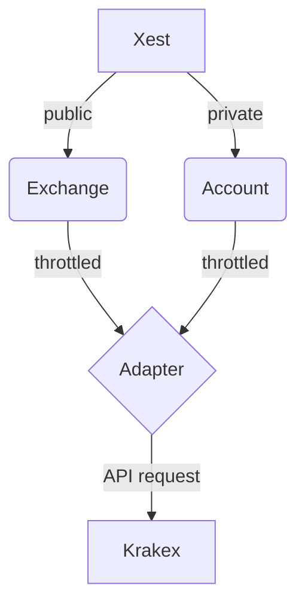

# XestKraken

```mermaid
graph TD
    A[Xest] --> |public| B(Exchange)
    A --> |private| C(Account)
    
    B --> |throttled| D{Adapter}
    C --> |throttled| D

    D --> |API request| E[Krakex]
```

