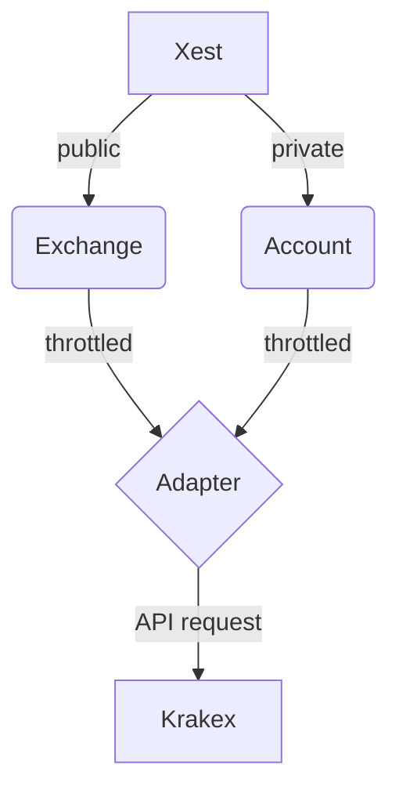

# XestKraken

**TODO: Add description**

## Development

```
iex -S mix
```




## Tests

The structure of tests is still moving. However we already have:

- unit tests, that run automatically, without requiring any configuration or server connection.
- tests of public endpoints, with cassettes of recorded traffic.
  These are located in the `tests/unit` folder.
- tests of private endpoints, with cassettes of recorded traffic.
  These are located in the `tests/integration` folder as they require some special care when manipulating...

We also have, although not running by default, a few more kinds of tests.
You can run them with:
`mix test --only integration`

These are:

- integration tests of public endpoints. These require a server connection.
- TODO: integration tests of private endpoints. These require a server connection and a correct configuration

### Recording cassettes

To record a new cassette, currently the project configuration and the test_helper in `tests/integration` must conspire to set the proper apikey and secret.
This is not foolproof just yet and will require more attention in the future.
